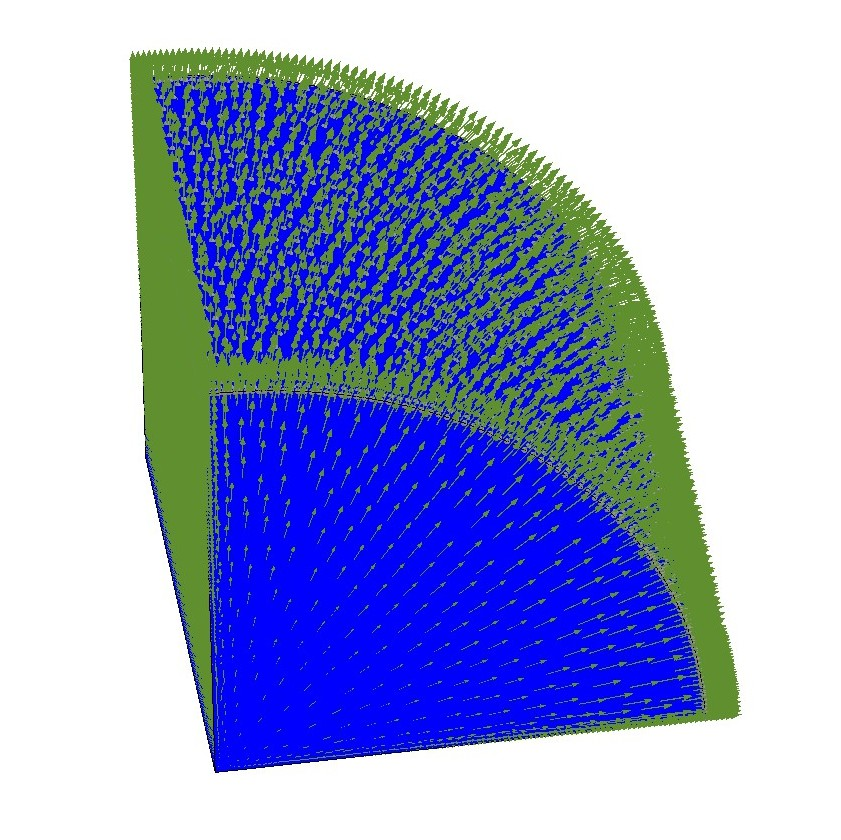
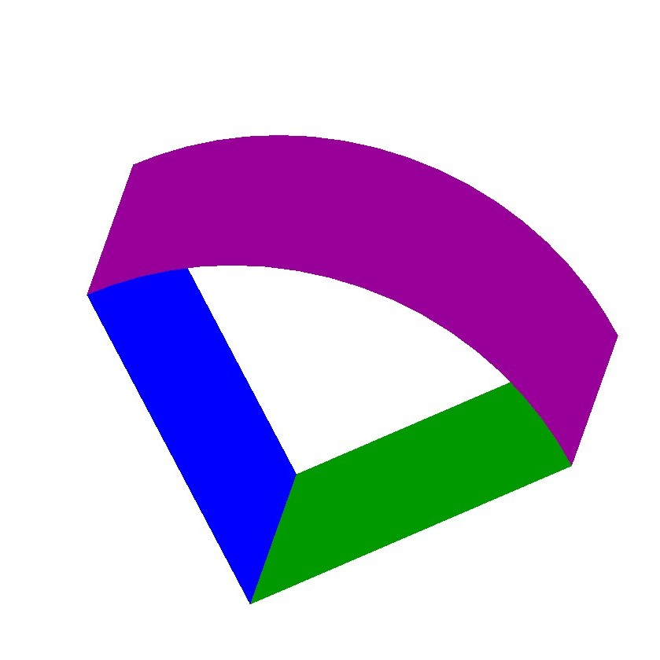
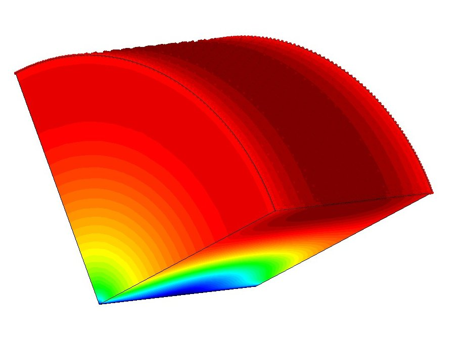
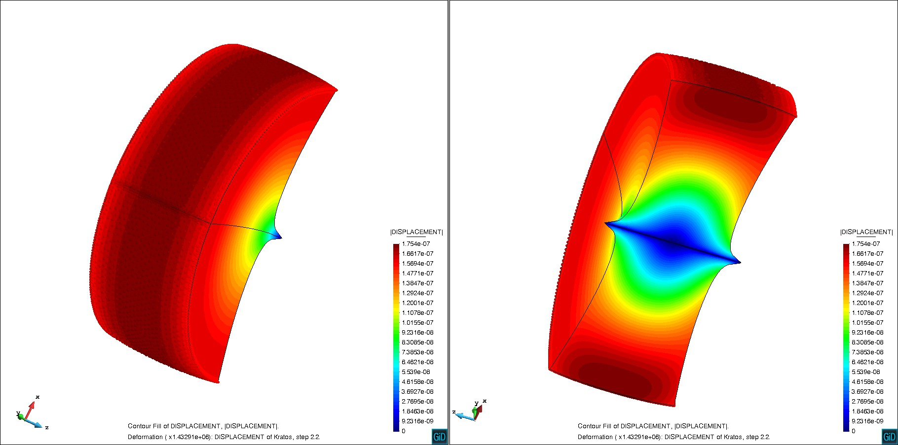

# Example for usage of Periodic Boundary conditions - Disk subjected to centrifugal forces

**Author:** Aditya Ghantasala

**Kratos version:** Current Head

**Source files:** [Disk subjected to centrifugal forces](https://github.com/KratosMultiphysics/Examples/tree/periodic_bc_examples/structural_mechanics/use_cases/periodic_bc_example/source)

## Problem definition
To demonstrate the usage of periodic boundary conditions. The problem is a disk subjected to centrifugal forces. Only a quarter of the disk is modeled by specifying periodic boundary conditions on the two faces.

_Centrifugal force on the disk[1]_

The below figure visualizes the surfaces (in Green and Blue) set as periodic boundaries. A zero Dirichlet boundary condition is applied on the line at the center of the disk.

_Visualization of Periodic boundaries [2]_

## Results

A simulation is performed with the above boundary conditions. The Displacement magnitude contour of  the simulation is as follows.

_Displacement contour[3]_

To visualize the periodicity the simulation result (quarter of the disk) is rotated (copy) by 90 degrees on its axis.

_Visualization of deformed (by displacement) geometry in different views_

