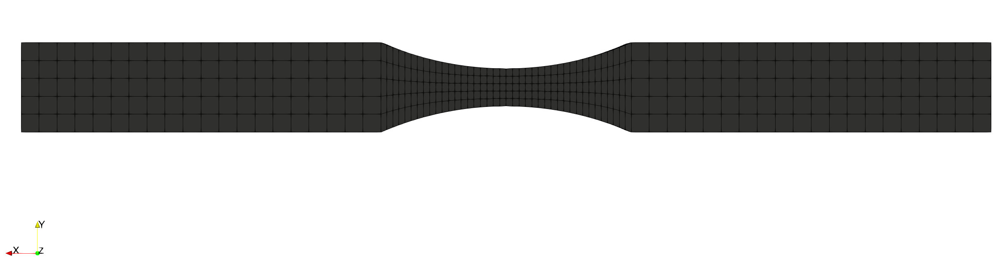
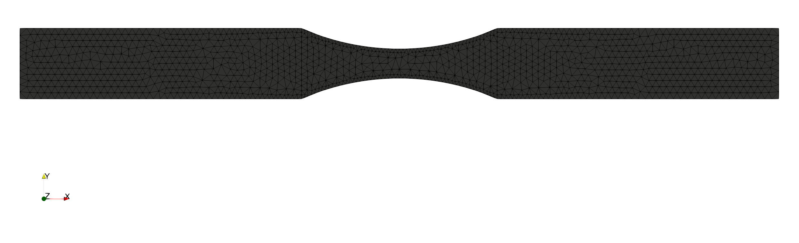
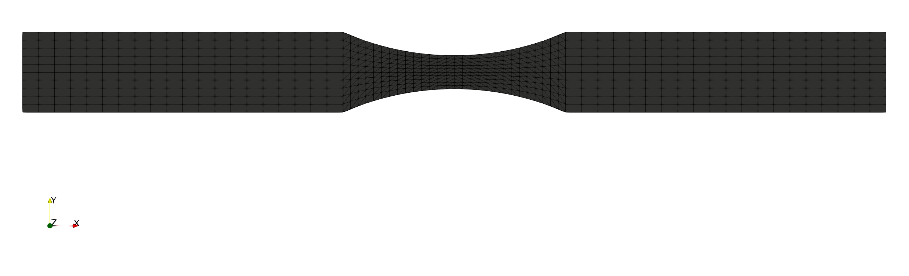
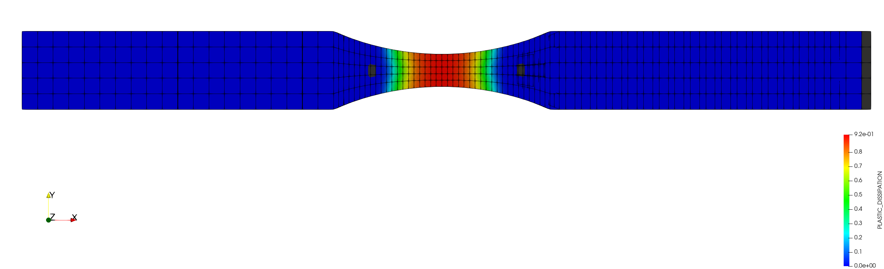
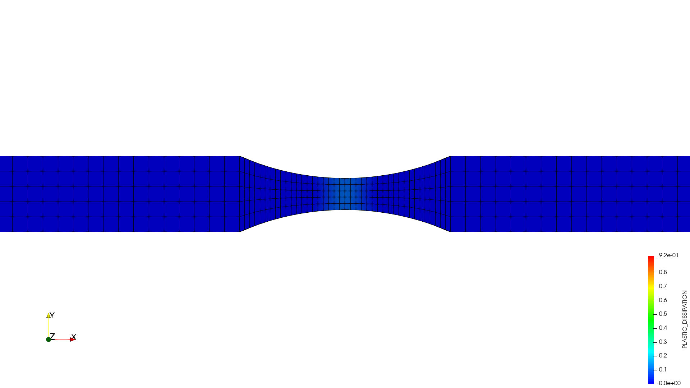

# Example of plasticity - Tensile test

**Author:** Vicente Mataix Ferrándiz - Alejandro Cornejo Velázquez

**Kratos version:** Current Head

**Source files:** [Tensile test](https://github.com/KratosMultiphysics/Examples/tree/periodic_bc_examples/structural_mechanics/use_cases/tensile_test_example/source)

## Problem definition

The problem consists on a [tensile test](https://en.wikipedia.org/wiki/Tensile_testing).  Three different meshes have been created, in order to validate the computation of the internal energy dissipation, whcih depends on the element length.

- The hexahedra mesh:

- The tetrahedra mesh:

- The wedge mesh:

## Results

The plastic dissipation at t=20s.

The whole animation:

