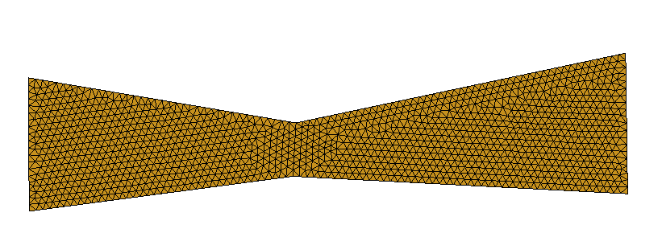
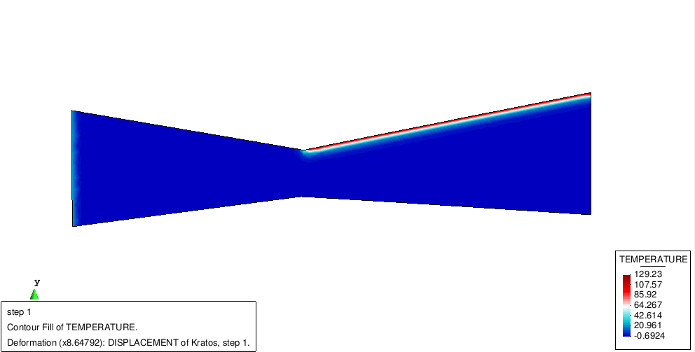
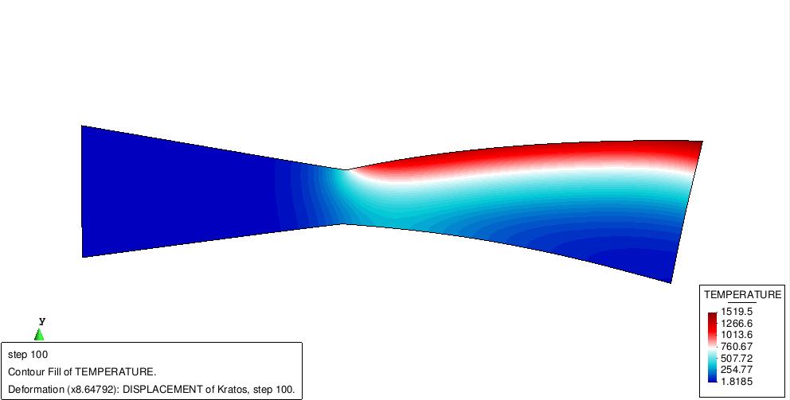
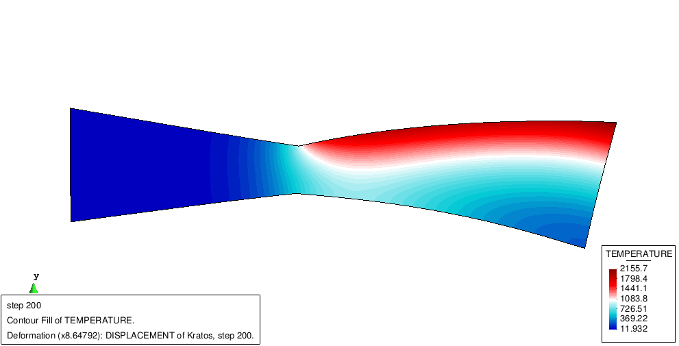

# Example of coupled thermo-mechanical calculation

**Author:** Alejandro Cornejo Velázquez

**Kratos version:** Current Head

**Source files:** [ThermoMechanical test](https://github.com/KratosMultiphysics/Examples/tree/master/structural_mechanics/use_cases/thermo_mechanical_coupling/source)

## Problem definition

The problem consists on a ThermoMechanical test.  In this case, an Eulerian convection-diffusion calcuation is performed and then a Lagrangian structural calculation is conducted. In this case, the temperature increment induces thermal strains (expansion in this case) and the material properties of the structural calculation are also affected (young modulus in this case).

- The simple mesh:

- The result at t=0:

- The result at t=100:

- The result at t=200:

## Results

The whole animation:

