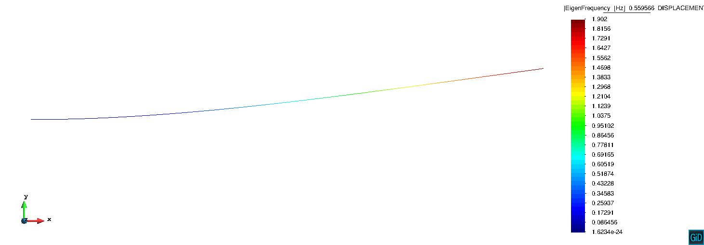
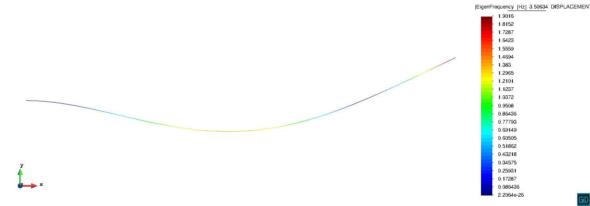
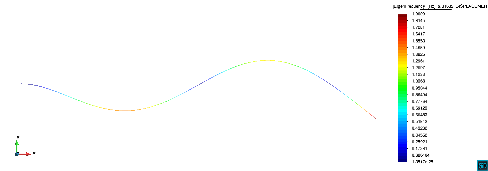

# Eigenvalue Computation for a cantilever beam

**Author:** Philipp Bucher

**Kratos version:** 6.0

**Source files:** [Beam Eigenvalues](https://github.com/KratosMultiphysics/Examples/tree/master/structural_mechanics/validation/beam_eigenvalue_analysis/source)

## Case Specification

This simple example shows how the eigenvalues (Eigenfrequencies and Eigenmodes) of a cantilever beam can be computed.

The properties of the beam can be seen in the [Materials file](https://github.com/KratosMultiphysics/Examples/tree/master/structural_mechanics/validation/beam_eigenvalue_analysis/source/StructuralMaterials.json)

Here we are only interested in the first three bending modes, for which we can calculate the analytical solution with ([source](http://me-lrt.de/eigenfrequenzen-eigenformen-beim-balken)):

fi = _&lambda;i/(2 &pi; L2)_ (_EI/&rho;A_)_1/2_

with lambda for the first eigenfrequencies being:
- &lambda;1 = 1.875
- &lambda;2 = 4.694
- &lambda;3 = 7.855

Using the specified properties we obtain for the first three bending modes:
- f1 = 0.5595 Hz
- f2 = 3.5068 Hz
- f3 = 9.82 Hz

The results obtained with Kratos are :
- f1 = 0.5596 Hz
- f2 = 3.5063 Hz
- f3 = 9.81685 Hz

The corresponding mode-shapes are shown below:

First Bending Mode

Second Bending Mode

Third Bending Mode

