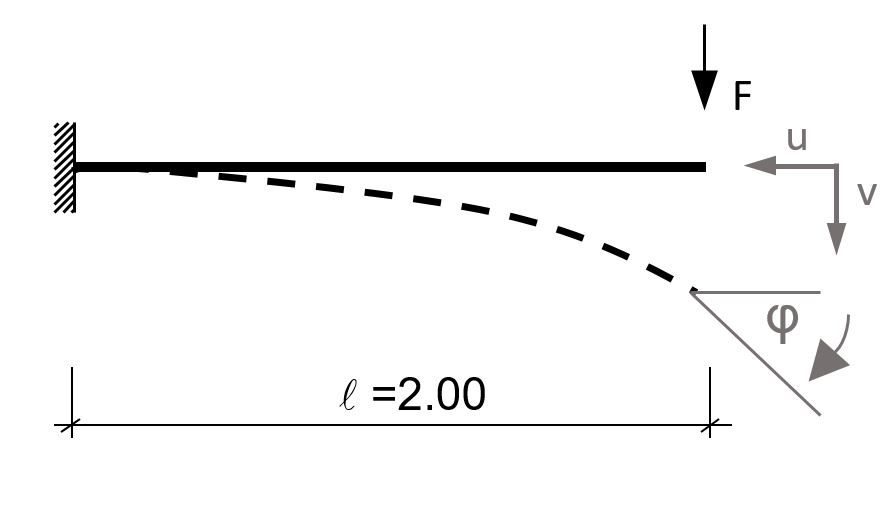
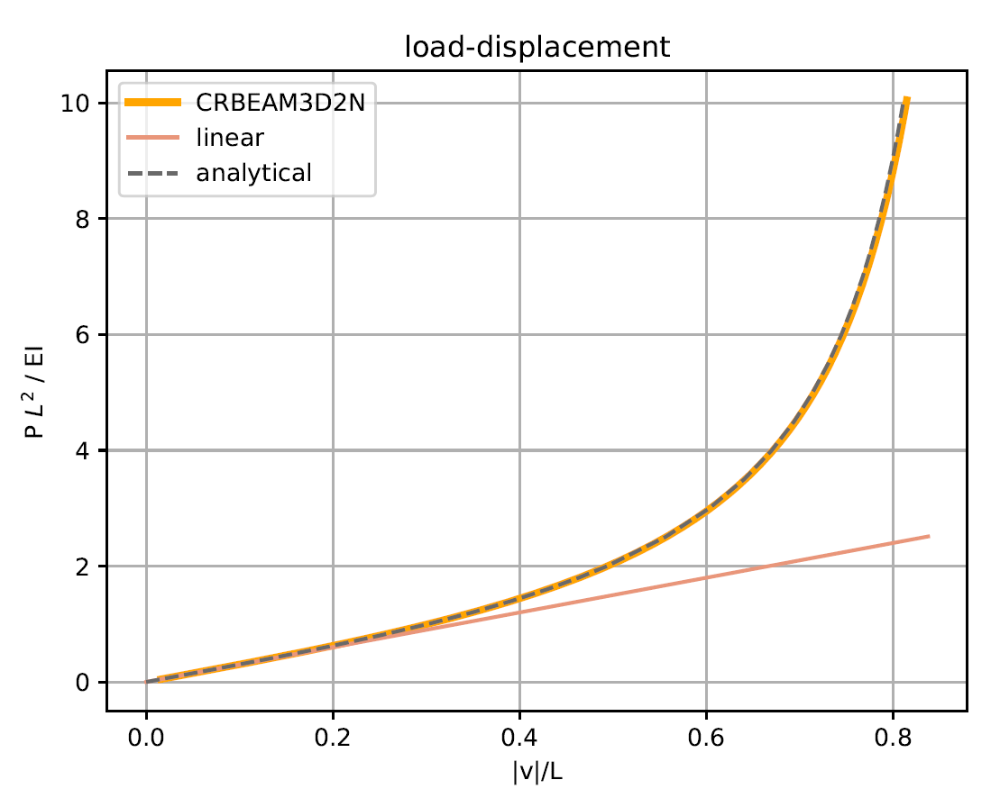
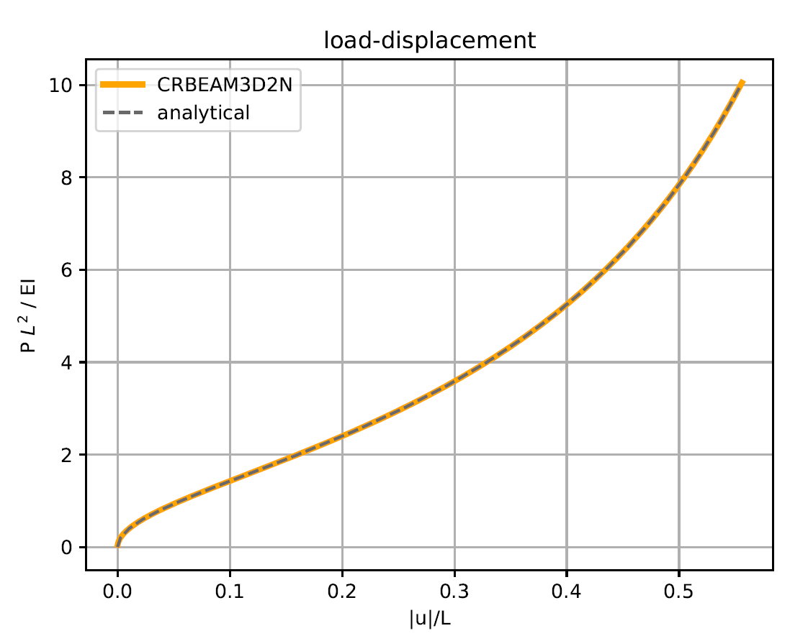
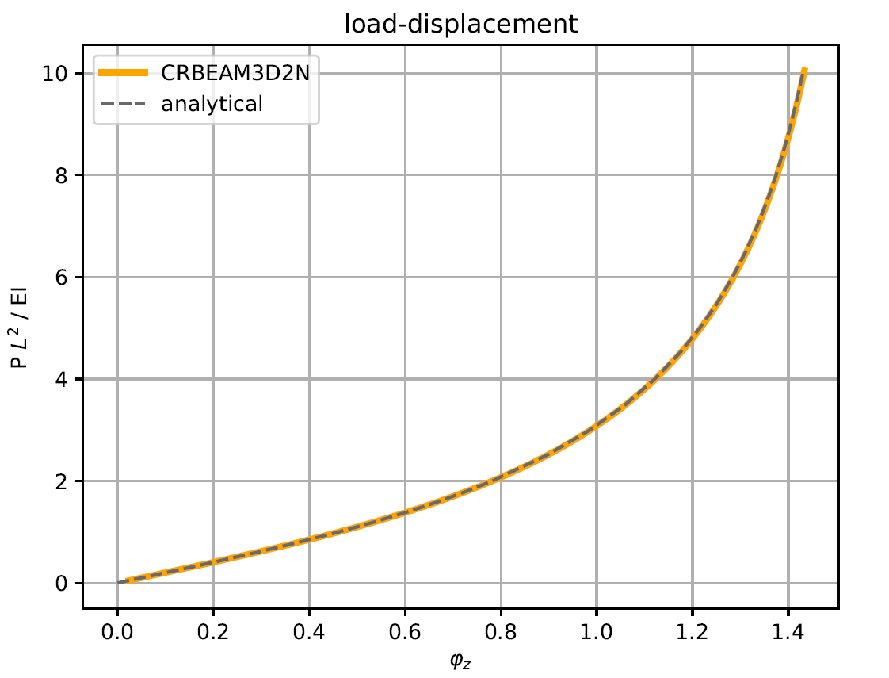
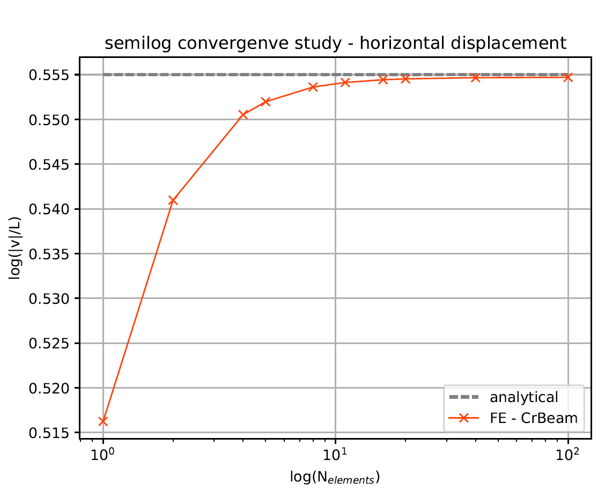

# Non-Linear Cantilever beam

**Author:** Klaus B. Sautter

**Kratos version:** 9.0

**Source files:** [Beam Non-Linear Cantilever](https://github.com/KratosMultiphysics/Examples/tree/master/structural_mechanics/validation/beam_nonlinear_cantilever/source)

## Problem definition
To demonstrate the ability of the co-rotational beam element to handle very large deformation a cantilever with L = 2.00 and a linearly increased transverse load is investigated:

_Statical System [1]_

With E = 210E09, ν = 0.30, A = 0.01 and Iz=Iy=IT = 0.00001.

## Results

By discretizing the total cantilever with 20 elements the following results, with respect to the three degrees of freedom, are obtained:

_Non-linear cantilever: Vertical displacement (20 elements)_

_Non-linear cantilever: Horizontal displacement (20 elements)_

_Non-linear cantilever: z-rotation (20 elements)_

A convergence study is done with respect to the horizontal dispalcement:

_Non-linear cantilever: Convergence study - horizontal displacement_

## References
1. Steen Krenk. Non-linear modeling and analysis of solids and structures. Cambridge
Univ. Press, 2009., pp. 115-116.
