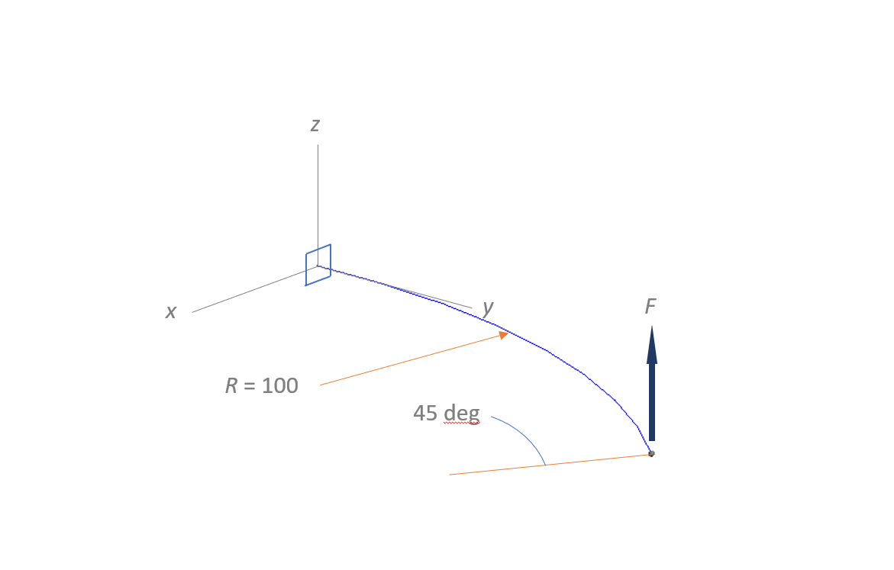
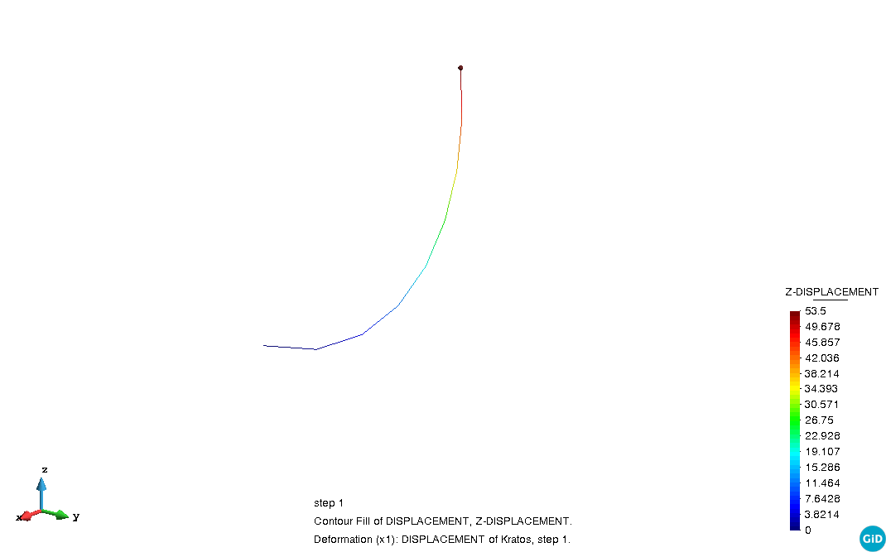
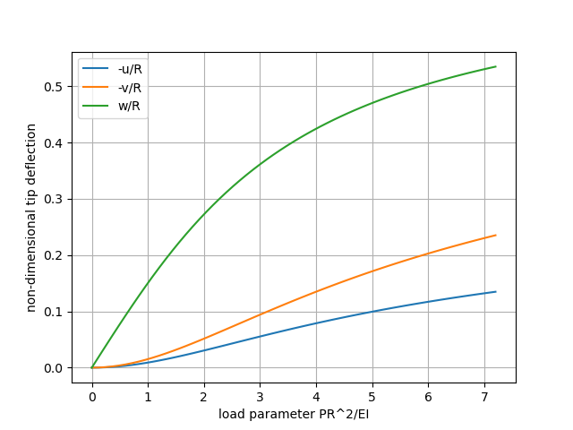

# Non-Linear cantilever beam (Bathe & Bolourchi)

**Author:** Carlos Lázaro

**Kratos version:** 8.1

**Source files:** [Beam Non-Linear Cantilever 3D Bathe](https://github.com/KratosMultiphysics/Examples/tree/master/structural_mechanics/validation/beam_nonlinear_cantilever3D_bathe/source)

## Problem definition

This is a classical test for coupled 3D bending, torsion and traction of a curved cantilever subjected to a transverse load. The cantilever has circular shape of radius 100 and spans 45 deg. The cross section is square (1 x 1).
The transverse end load _F_ increases up to a magnitude of 600. The load has fixed direction throughout the whole process.

_Bathe & Bolourchi cantilever: static system_

According to [1], _E_ = 1.0 E+07, _ν_ = 0 and _A_ = 1.0  
_Iy_ = _Iz_ = 0.0833333  
The value of _It_ is not given in the original article. The best approximation to the results of the article is achieved taking _It_ = _I0_ = 0.1666667

## Results

The 8-element discretization follows the original example in reference [1]. The load is applied in 60 steps with a load-control strategy. The following figure shows the (non-scaled) final configuration corresponding to the load of magnitude 600.

_Bathe & Bolourchi cantilever: Non-scaled deformed shape for the total load (8 elements, tip load F = 600 applied in 60 steps)_  

The equilibrium paths corresponding to the tip displacements are plotted following the style of [1]:

_Bathe & Bolourchi cantilever: Equilibrium paths for each component of the tip displacement in non-dimensional coordinates_  

The comparison between the computed displacements of the tip and those given in [1] is:  

|  | Computed | Reference [1]  
|--|----------|---------------  
|u | -13.4890 | -13.4  
|v | -23.5318 | -23.5  
|w |  53.4998 |  53.4  

## References

[1] K.-J. Bathe, S. Bolourchi. Large displacement analysis of three-dimensional beam structures. _International Journal for Numerical Methods in Engineering_, 1979, vol. 14, pp. 961-986.
