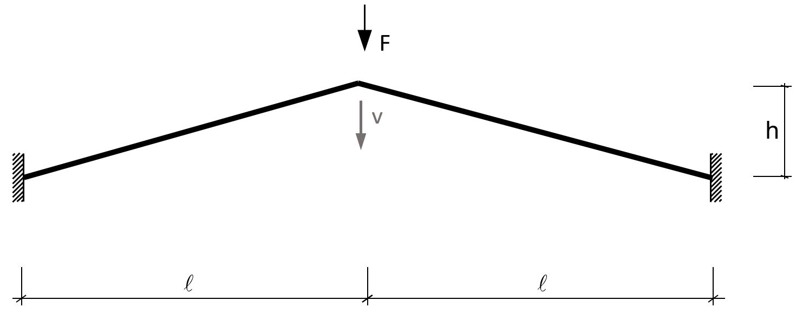
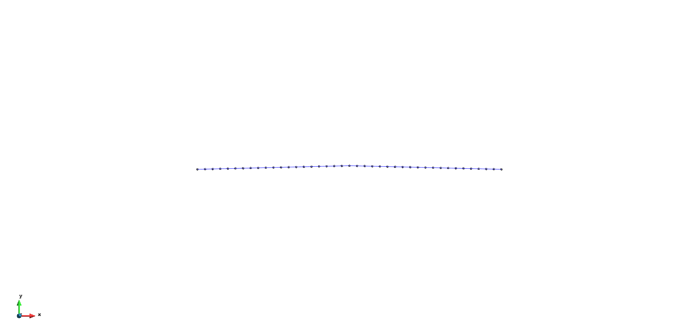
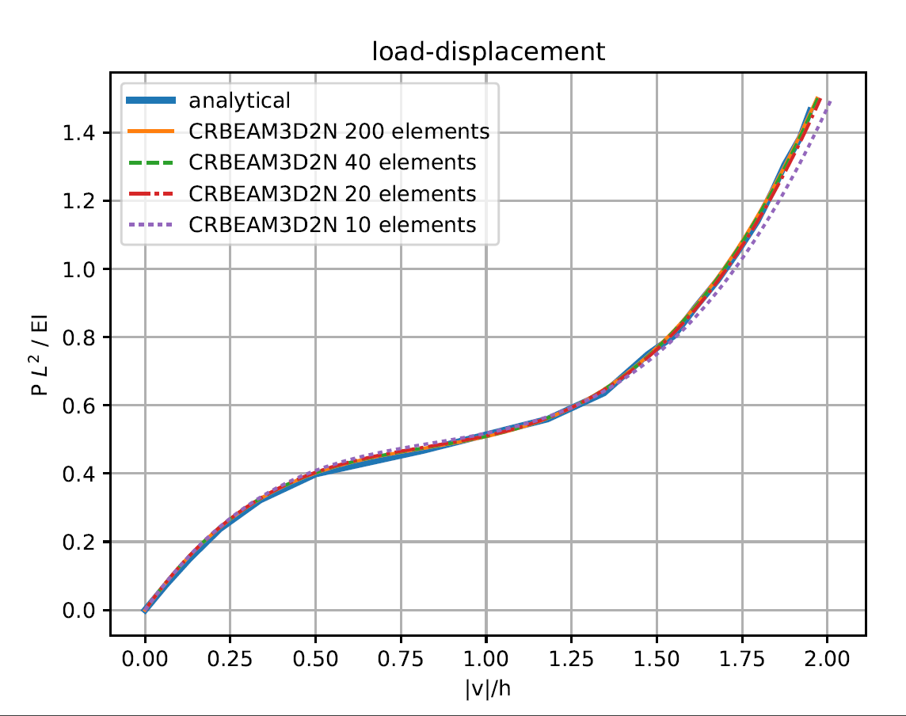

# Shallow Angled Beam Structure

**Author:** Klaus B. Sautter

**Kratos version:** 5.2

**Source files:** [Beam Shallow-angled Structure](https://github.com/KratosMultiphysics/Examples/tree/master/structural_mechanics/validation/beam_shallow_angled_structure)

## Problem definition
As the effect of bending on the shorting of the beam element is not included in the underlying co-rotational beam theory, the following example shows, how this effect can be modeled with the help of multiple beam elements. For that purpose the following shallow angled beam is investigated:

_Statical System [1]_

With L = 10, h = 0.24, E = 210E09, ν = 0.30, A = 0.01 and Iz=Iy=IT = 3.34E-05. Whereas the load F is linearly increased.

## Results

The following deformation (exaggerated) animation of the Kratos is provided for context:

The results of the vertical deformation of the middle node are given in the following graph, where both the axes are scaled:

_Vertical Displacement of the middle top node_

## References
1. Steen Krenk. Non-linear modeling and analysis of solids and structures. Cambridge
Univ. Press, 2009., pp. 116-117.
