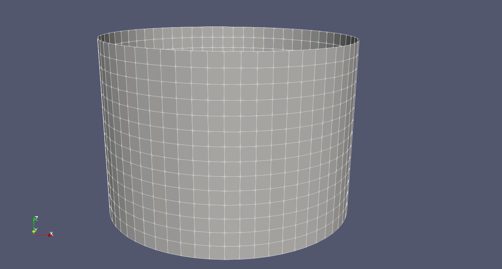
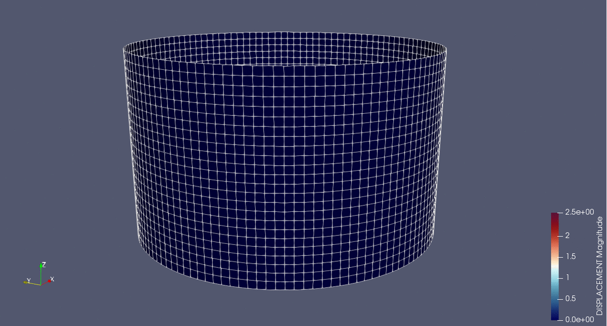
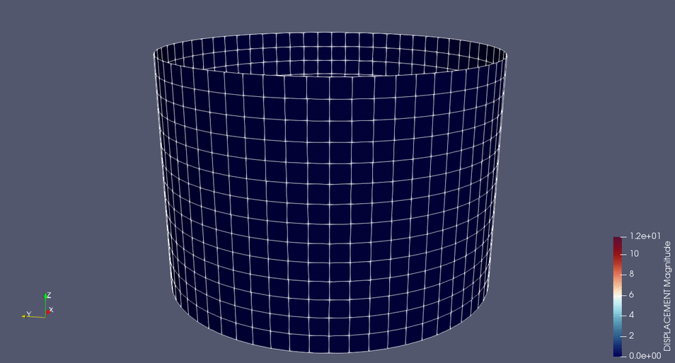

# Form-finding for a pre-stressed membrane catenoid

**Author:** Klaus B. Sautter

**Kratos version:** 7.0

**Source files:** [Membrane Catenoid](https://github.com/KratosMultiphysics/Examples/tree/master/structural_mechanics/validation/catenoid_formfinding/source)

## Case Specification
An isotropic pre-stressed catenoid with membrane elements is used to perform form-finding using KRATOS (StructuralMechanicsApplication).

System of the catenoid [1]

The radius of the initial cylindric geoemtry is 10.00[m] and the height is varied from 12.00[m] to 14.00[m].
Both results are presented in the following.

While the 12.00[m] high cylinder results in a catenoid,

the result of the 14.00[m] high cylinder is described by two plane surfaces (minimal area).

