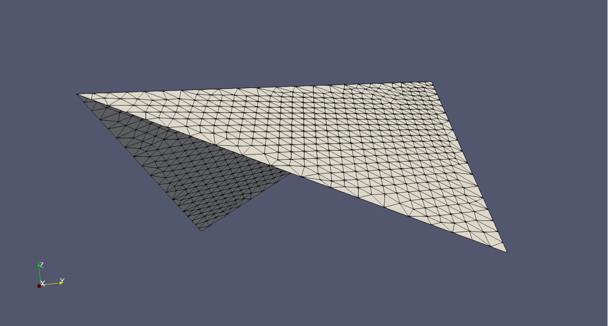
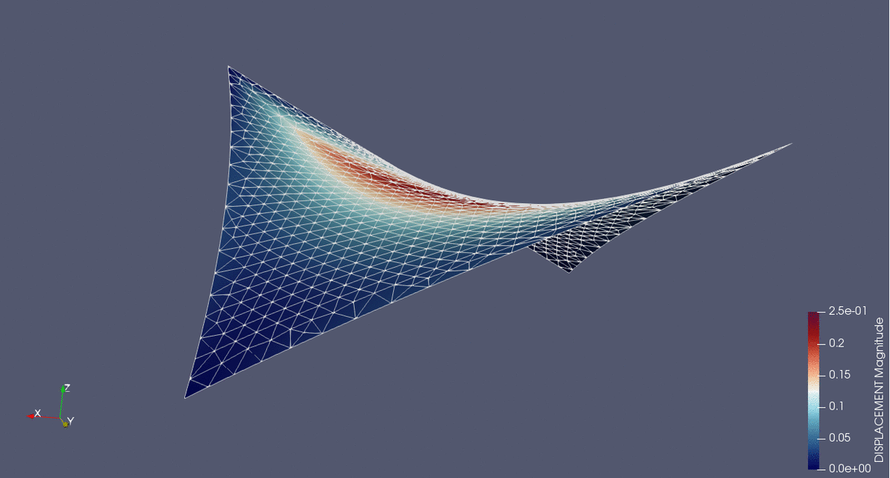

# Form-finding for a four point sail membrane

**Author:** Klaus B. Sautter

**Kratos version:** 7.0

**Source files:** [Membrane Four Point Sail](https://github.com/KratosMultiphysics/Examples/tree/master/structural_mechanics/validation/four_point_sail_formfinding/source)

## Case Specification
An isotropic pre-stressed four point sail with membrane elements is used to perform form-finding using KRATOS (StructuralMechanicsApplication).

Reference system of the four point sail.

Final geometry.

