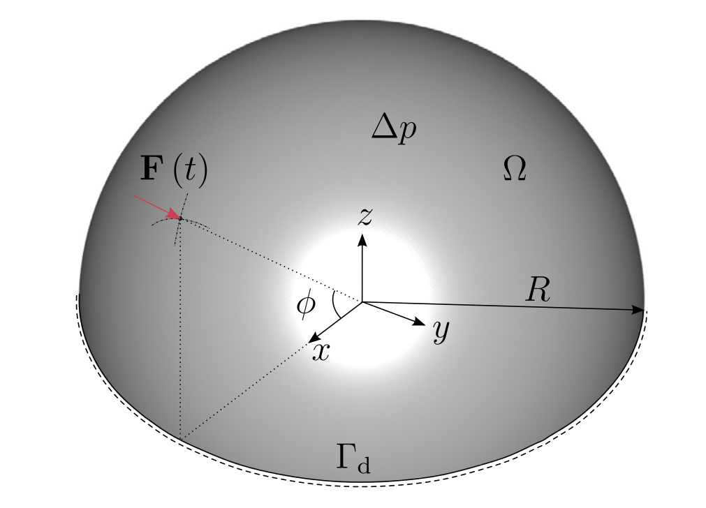
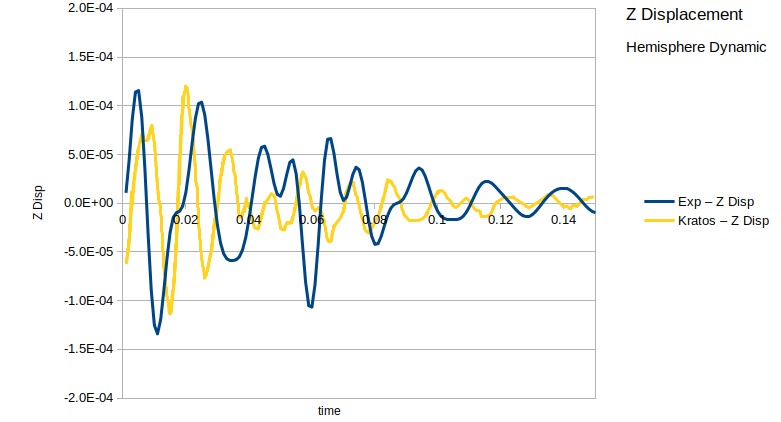

# Verification and Eigenvalue Computation for a Membrane Hemisphere

**Author:** Klaus B. Sautter

**Kratos version:** 7.0

**Source files:** [Membrane Hemisphere](https://github.com/KratosMultiphysics/Examples/tree/master/structural_mechanics/validation/membrane_hemisphere/source)

## Case Specification
For validation purposes the set-up from [1] is used as a reference and simulated using KRATOS (StructuralMechanicsApplication,EigenSolversApplication).

System of a hemisphere [1]

All relevant data can be viewed in the referenced publication [1].

The solution of a dynamic simulation is plotted against an experimentally obtained solution [1]. For this case the hemisphere is prestressed, subjected to internal pressure and a short impuls is applied at the beginning of the simulation. The following figure shows good agreement with the experiment results.

_Compare KRATOS displacements of the top node to [1]_

Additioanlly the _EigenSolversApplication_ is used to analyse the first 56 eigenmodes of the hemisphere. The results again agree with [1] and are plotted in the next figure.

_Eigenmodes 1,3,4,6,8,10,11,13,22,31,33,56_

## References
1. G. De Nayer, A. Apostolatos, J.N. Wood, K.U. Bletzinger, R. Wüchner, M. Breuer
Numerical studies on the instantaneous fluid–structure interaction of an air-inflated flexible membrane in turbulent flow
Journal of Fluids and Structures 82 (2018) 577–609