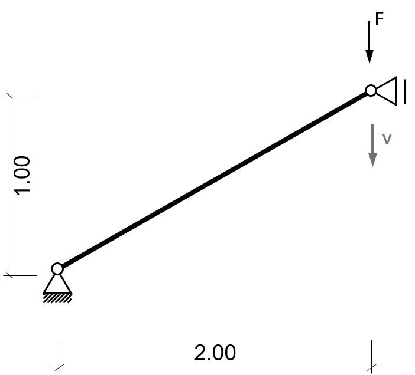
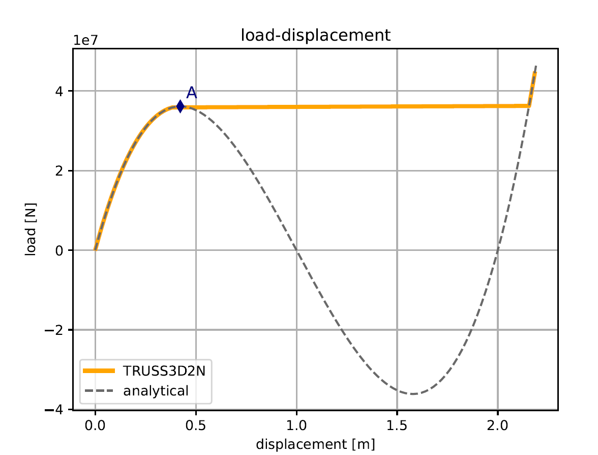
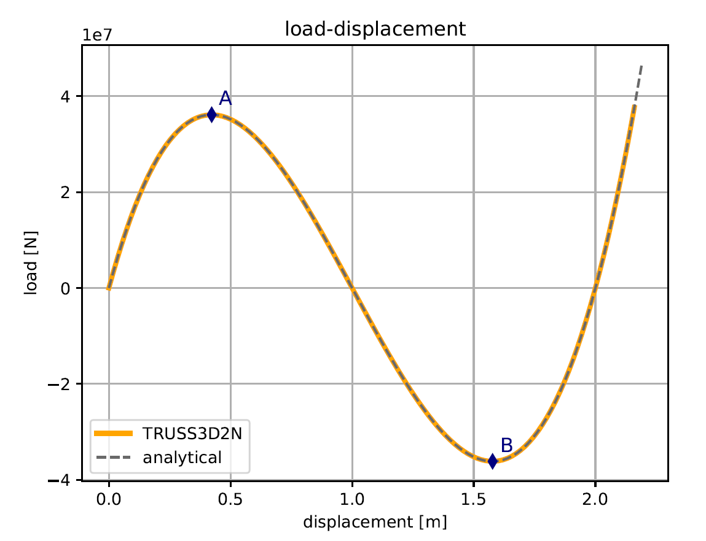

# Two-Bar-Truss Snapthrough

**Author:** Klaus B. Sautter

**Kratos version:** 5.2

**Source files:** [Truss Two-Bar-Truss Snapthrough](https://github.com/KratosMultiphysics/Examples/tree/master/structural_mechanics/validation/truss_snap_through/source)

## Problem definition
To demonstrate the ability of the non-linear truss element to describe geometric non-linearities the following symmetry of a two bar truss is investigated:

_Statical System [1]_

With E = 210E09 and A = 0.01.

## Results

Two different approaches can be used to analyze the structure.

By incrementally increasing the load and solving for the residual to be zero the first limit point can be found:

_Non-linear snap through: Load-control_ `python3 MainKratos.py ProjectParametersLoadControl.json`

Whereas both limit points can be found by incrementally increasing the displacement and solving for the residual to be zero:

_Non-linear snap through: Displacement-control_ `python3 MainKratos.py ProjectParametersDisplacementControl.json`

## References
1. Steen Krenk. Non-linear modeling and analysis of solids and structures. Cambridge
Univ. Press, 2009., pp. 28-29.
