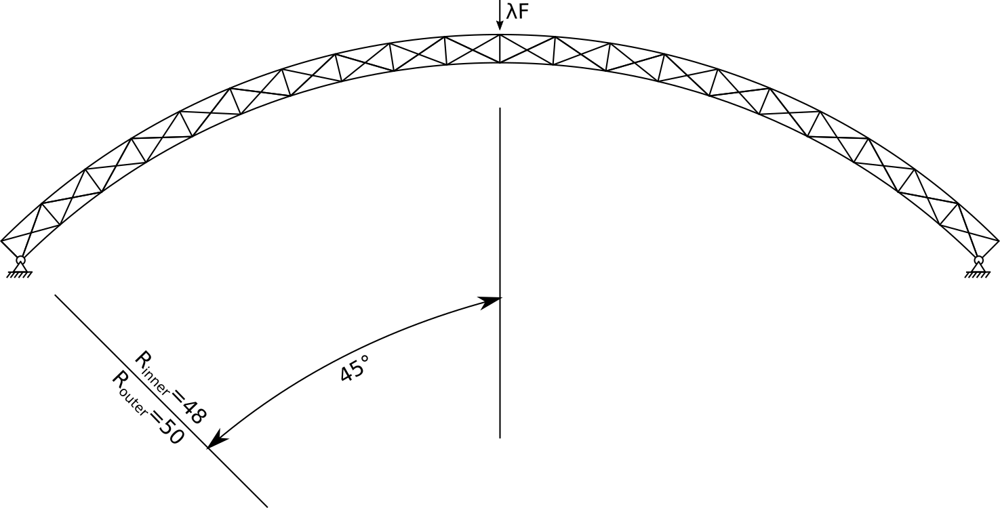
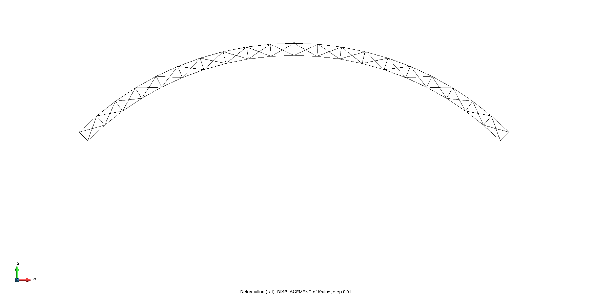
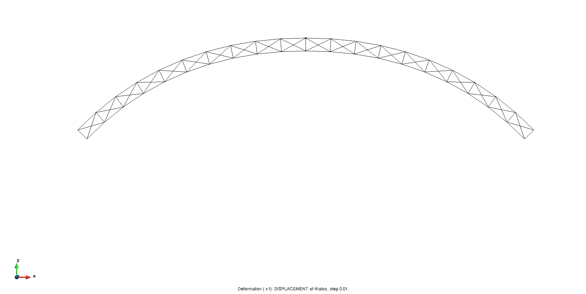
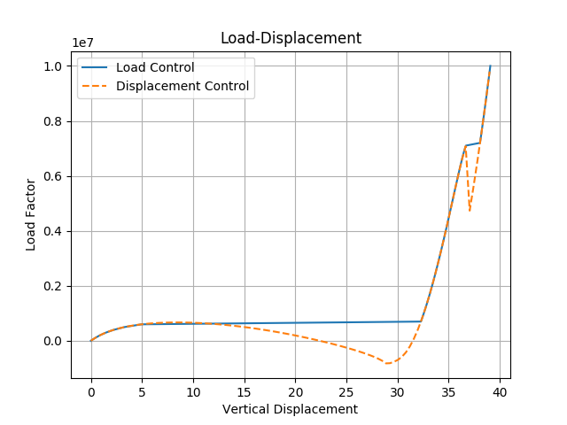

# Two-Dimensional Circular Truss-Arch Snapthrough

**Author:** Mahmoud Zidan

**Kratos version:** 7.0

**Source files:** [Two-Dimensional Circular Truss-Arch Snapth rough](https://github.com/KratosMultiphysics/Examples/tree/master/structural_mechanics/validation/two_dimensional_circular_truss_arch_snapthrough/source)

## Problem definition
The two different non-linear solutions, namely displacement control and load control, are demonstrated on this example, introduced by (Crisfield, 1997). The problem consists of a two-dimensional arch made of a truss system, where a load is applies at the apex, and the load factor vs. the vertical displacement is studied,

Static System [1]

with E = 5E9, A = 0.01, and F=1.

## Results

This structure is solved using the non-linear truss element in the two following approaches:

### Load Control

Incrementally prescribing the load factor and solving for the apex vertical displacement.

Non-linear snap through: Load-control

### Displacement Control

Incrementally prescribing the apex vertical displacement  and solving for the load factor.

Non-linear snap through: Displacement-control

The following figure shows the load displacement curve for the two approaches.

Load Displacement curve.

## References
1. Crisfield, M. A., 1997. Non-Linear Finite Element Analysis of Solids and Structures. Volume 2: Advanced Topics. pp 407-410.
